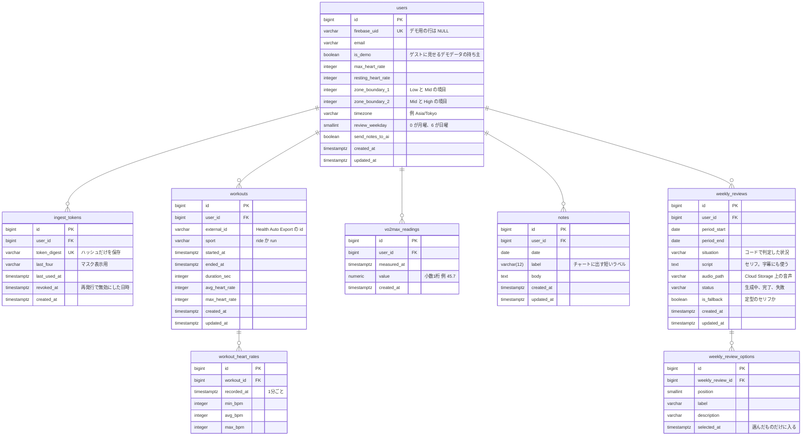

# ER 図

## 一意制約

| テーブル | カラム | 理由 |
|---|---|---|
| users | firebase_uid | Google アカウント1つにつき、利用者は1人 |
| ingest_tokens | token_digest | トークンから利用者を特定する |
| workouts | user_id, external_id | 同じ記録が何度届いても、二重に数えない |
| vo2max_readings | user_id, measured_at | 同じ測定が何度届いても、二重に数えない |
| notes | user_id, date | メモは1日1件 |
| weekly_reviews | user_id, period_start | 同じ期間の振り返りを、二重に作らない |

## 保存しない値

負荷、体力、疲労、余力、強度ごとの時間は、保存しません。`workout_heart_rates` の1分ごとの心拍と、`users` の心拍の設定から、表示のたびに計算します。心拍の設定を変えても、過去の記録を計算し直す処理は要りません。

メモとワークアウトは、外部キーでつなぎません。ワークアウト詳細に出す「その日のメモ」は、利用者のタイムゾーンでの日付で探します。

## ゲストのデータ

ゲストログインでは、`is_demo` の利用者1人ぶんのデモデータを、ゲスト全員で共有します。ゲストができるのは閲覧だけです。メモの保存、設定の変更、トークンの発行、選択肢の保存、アカウントの削除はできません。振り返りのセリフと音声は、デモ用に作っておいたものを流します。
